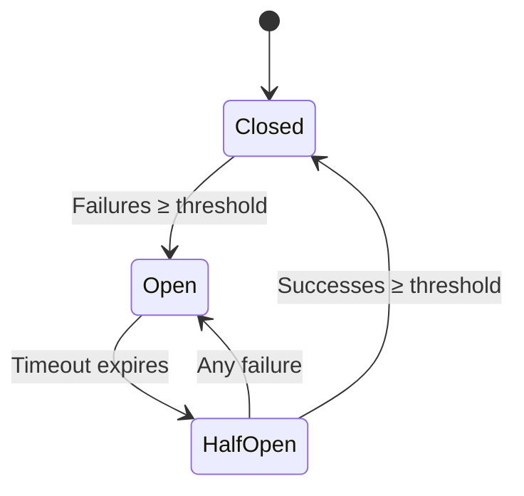

[](https://buymeacoffee.com/anhaia)

# PHP Circuit Breaker

A robust, production-ready implementation of the [Circuit Breaker pattern](https://martinfowler.com/bliki/CircuitBreaker.html) for PHP. Protect your microservices from cascading failures with configurable thresholds, multiple storage backends, an event system, and manual override capabilities.

## How It Works



| State | Description |
|-------|-------------|
| **Closed** | Normal operation. Requests pass through. Failures are counted. |
| **Open** | Circuit is tripped. All requests are rejected immediately. |
| **Half-Open** | Recovery probe. Limited requests are allowed to test if the service has recovered. |

## Installation

```bash
composer require gabrielanhaia/php-circuit-breaker:^3.0
```

### Optional Dependencies

Install only what you need:

```bash
# For Redis storage
# Requires ext-redis PHP extension

# For PSR-16 (SimpleCache) storage
composer require psr/simple-cache

# For PSR-6 (Cache) storage
composer require psr/cache

# For PSR-14 event dispatcher bridge
composer require psr/event-dispatcher
```

## Quick Start

```php
use GabrielAnhaia\PhpCircuitBreaker\CircuitBreaker;
use GabrielAnhaia\PhpCircuitBreaker\CircuitBreakerConfig;
use GabrielAnhaia\PhpCircuitBreaker\Storage\InMemoryStorage;

$storage = new InMemoryStorage();
$config  = new CircuitBreakerConfig(
    failureThreshold: 5,
    openTimeout:      30,
);

$cb = new CircuitBreaker($storage, $config);

$service = 'payment-api';

if (!$cb->canPass($service)) {
    // Circuit is open — use fallback
    return cachedResponse();
}

try {
    $result = callPaymentApi();
    $cb->recordSuccess($service);
    return $result;
} catch (\Throwable $e) {
    $cb->recordFailure($service);
    return cachedResponse();
}
```

## Features

- **Multiple storage backends** — InMemory, Redis, APCu, Memcached, PSR-6, PSR-16
- **Success threshold** — require N consecutive successes before closing a half-open circuit
- **Event system** — react to state changes with listeners; optional PSR-14 bridge
- **Manual override** — force circuits open/closed for maintenance windows or testing
- **State inspection** — query effective circuit state at any time
- **Immutable config** — type-safe `CircuitBreakerConfig` value object
- **Zero required extensions** — only `ext-redis`, `ext-apcu`, `ext-memcached` needed if you use those adapters
- **PHPStan level max** — fully statically analyzed
- **PHP 8.1+** — uses native enums, readonly properties, and named arguments

## Documentation

| Topic | Description |
|-------|-------------|
| [Configuration](docs/configuration.md) | Config object, parameter table, exception mode |
| [Storage Adapters](docs/storage-adapters.md) | All 6 adapters, key scheme, comparison table |
| [Event System](docs/events.md) | Events, sequence diagram, SimpleEventDispatcher, PSR-14 bridge |
| [Manual Override](docs/manual-override.md) | `forceState()`, `clearOverride()`, state inspection |
| [Architecture](docs/architecture.md) | Class diagram, directory structure, request flow |

## Upgrading from v2

See [UPGRADE-3.0.md](UPGRADE-3.0.md) for a detailed migration guide.

### Key Breaking Changes

| v2 | v3 |
|----|-----|
| `CircuitStateEnum` | `CircuitState` (backing value `'close'` → `'closed'`) |
| `CircuitBreakerAdapter` (abstract class) | `CircuitBreakerStorageInterface` |
| `new CircuitBreaker($adapter, $settings)` | `new CircuitBreaker($storage, $config)` |
| `Alert` interface | Event listeners |
| `AdapterException` | `StorageException` |
| `CircuitException` | `OpenCircuitException` |
| `ext-redis` required | `ext-redis` optional (suggested) |

### Deprecated Methods (Removed in v4)

- `$cb->failed($service)` → use `$cb->recordFailure($service)`
- `$cb->succeed($service)` → use `$cb->recordSuccess($service)`

## Development

```bash
# Install dependencies
composer install

# Run tests
composer test                              # All tests
vendor/bin/phpunit --testsuite Unit        # Unit tests only
vendor/bin/phpunit --testsuite Integration # Integration tests only

# Static analysis
composer phpstan

# Code style
composer cs-check    # Check for violations
composer cs-fix      # Auto-fix violations
```

### CI

GitHub Actions runs on PHP 8.1, 8.2, 8.3, 8.4 with three jobs:
- **Tests** — unit + integration (with Redis service)
- **Static Analysis** — PHPStan level max
- **Code Style** — PHP-CS-Fixer (PER-CS + PHP 8.1 migration)

## Support

If this library helps you, consider buying me a coffee:

[](https://buymeacoffee.com/anhaia)

## License

MIT — see [LICENSE](LICENSE) for details.

---

Created by [Gabriel Anhaia](https://www.linkedin.com/in/gabrielanhaia) | [Buy Me a Coffee](https://buymeacoffee.com/anhaia)
