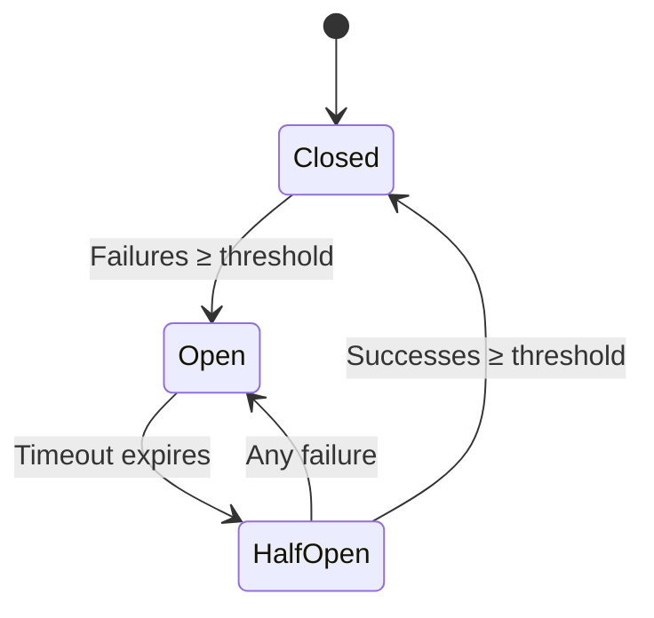
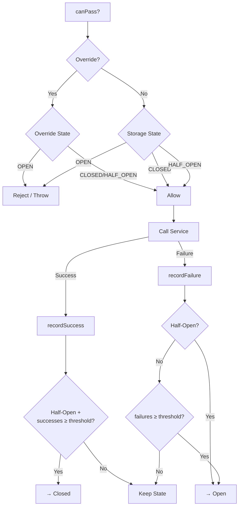
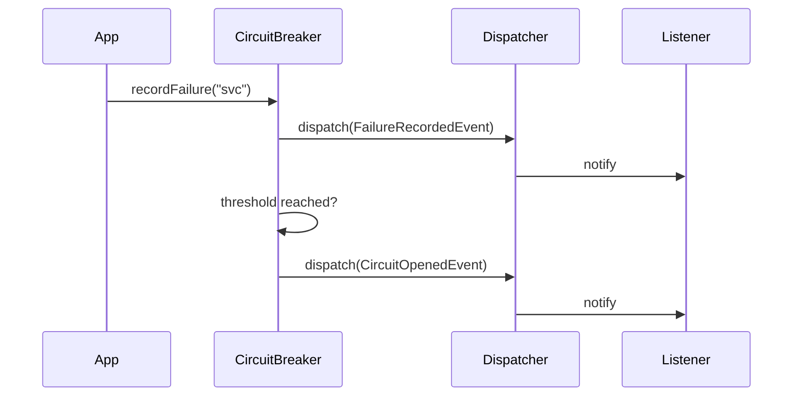
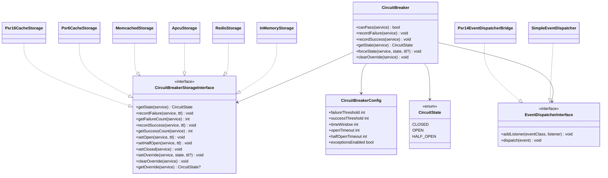

[](https://buymeacoffee.com/anhaia)

# PHP Circuit Breaker

A robust, production-ready implementation of the [Circuit Breaker pattern](https://martinfowler.com/bliki/CircuitBreaker.html) for PHP. Protect your microservices from cascading failures with configurable thresholds, multiple storage backends, an event system, and manual override capabilities.

## Table of Contents

- [Features](#features)
- [How It Works](#how-it-works)
- [Installation](#installation)
- [Quick Start](#quick-start)
- [Configuration](#configuration)
- [Storage Adapters](#storage-adapters)
- [Event System](#event-system)
- [Manual Override](#manual-override)
- [State Inspection](#state-inspection)
- [Architecture](#architecture)
- [Upgrading from v2](#upgrading-from-v2)
- [Development](#development)
- [License](#license)

## Features

- **Multiple storage backends** — InMemory, Redis, APCu, Memcached, PSR-6, PSR-16
- **Success threshold** — require N consecutive successes before closing a half-open circuit
- **Event system** — react to state changes with listeners; optional PSR-14 bridge
- **Manual override** — force circuits open/closed for maintenance windows or testing
- **State inspection** — query effective circuit state at any time
- **Immutable config** — type-safe `CircuitBreakerConfig` value object
- **Zero required extensions** — only `ext-redis`, `ext-apcu`, `ext-memcached` needed if you use those adapters
- **PHPStan level max** — fully statically analyzed
- **PHP 8.1+** — uses native enums, readonly properties, and named arguments

## How It Works

The circuit breaker monitors calls to external services and prevents cascading failures by transitioning through three states:



| State | Description |
|-------|-------------|
| **Closed** | Normal operation. Requests pass through. Failures are counted. |
| **Open** | Circuit is tripped. All requests are rejected immediately. |
| **Half-Open** | Recovery probe. Limited requests are allowed to test if the service has recovered. |

### Request Flow



## Installation

```bash
composer require gabrielanhaia/php-circuit-breaker:^3.0
```

### Optional Dependencies

Install only what you need:

```bash
# For Redis storage
# Requires ext-redis PHP extension

# For PSR-16 (SimpleCache) storage
composer require psr/simple-cache

# For PSR-6 (Cache) storage
composer require psr/cache

# For PSR-14 event dispatcher bridge
composer require psr/event-dispatcher
```

## Quick Start

```php
use GabrielAnhaia\PhpCircuitBreaker\CircuitBreaker;
use GabrielAnhaia\PhpCircuitBreaker\CircuitBreakerConfig;
use GabrielAnhaia\PhpCircuitBreaker\Storage\InMemoryStorage;

$storage = new InMemoryStorage();
$config  = new CircuitBreakerConfig(
    failureThreshold: 5,
    openTimeout:      30,
);

$cb = new CircuitBreaker($storage, $config);

$service = 'payment-api';

if (!$cb->canPass($service)) {
    // Circuit is open — use fallback
    return cachedResponse();
}

try {
    $result = callPaymentApi();
    $cb->recordSuccess($service);
    return $result;
} catch (\Throwable $e) {
    $cb->recordFailure($service);
    return cachedResponse();
}
```

## Configuration

All settings are defined via the immutable `CircuitBreakerConfig` value object:

```php
$config = new CircuitBreakerConfig(
    failureThreshold:  5,     // Failures within window to trip the circuit
    successThreshold:  1,     // Consecutive successes to close a half-open circuit
    timeWindow:        20,    // Seconds to track failures
    openTimeout:       30,    // Seconds the circuit stays open before half-open
    halfOpenTimeout:   20,    // Seconds the half-open state can last
    exceptionsEnabled: false, // Throw OpenCircuitException instead of returning false
);
```

| Parameter | Default | Description |
|-----------|---------|-------------|
| `failureThreshold` | `5` | Number of failures within `timeWindow` to open the circuit |
| `successThreshold` | `1` | Consecutive successes needed in half-open to close the circuit |
| `timeWindow` | `20` | Seconds over which failures are counted |
| `openTimeout` | `30` | How long (seconds) the circuit remains open |
| `halfOpenTimeout` | `20` | How long (seconds) the half-open state can last before auto-closing |
| `exceptionsEnabled` | `false` | If `true`, `canPass()` throws `OpenCircuitException` instead of returning `false` |

### Exception Mode

```php
use GabrielAnhaia\PhpCircuitBreaker\Exception\OpenCircuitException;

$config = new CircuitBreakerConfig(exceptionsEnabled: true);
$cb = new CircuitBreaker($storage, $config);

try {
    $cb->canPass('payment-api');
} catch (OpenCircuitException $e) {
    echo $e->getServiceName(); // "payment-api"
}
```

## Storage Adapters

All adapters implement `CircuitBreakerStorageInterface`. The circuit breaker owns all state transition logic — adapters are dumb storage.

### InMemory (Testing / Development)

```php
use GabrielAnhaia\PhpCircuitBreaker\Storage\InMemoryStorage;

$storage = new InMemoryStorage();
```

State lives in a PHP array. Useful for tests and single-request scripts.

### Redis

```php
use GabrielAnhaia\PhpCircuitBreaker\Storage\RedisStorage;

$redis = new \Redis();
$redis->connect('127.0.0.1', 6379);

$storage = new RedisStorage($redis, prefix: 'cb:');
```

Uses atomic `INCR` + `EXPIRE` in `MULTI/EXEC` transactions. No `KEYS` command. Production-recommended.

**Key scheme:**
```
{prefix}{service}:failures
{prefix}{service}:successes
{prefix}{service}:state:open
{prefix}{service}:state:half_open
{prefix}{service}:override
```

### APCu

```php
use GabrielAnhaia\PhpCircuitBreaker\Storage\ApcuStorage;

$storage = new ApcuStorage(prefix: 'cb:');
```

> **Note:** APCu is per-process. CLI and web processes have separate caches. Set `apc.enable_cli=1` for CLI usage.

### Memcached

```php
use GabrielAnhaia\PhpCircuitBreaker\Storage\MemcachedStorage;

$memcached = new \Memcached();
$memcached->addServer('127.0.0.1', 11211);

$storage = new MemcachedStorage($memcached, prefix: 'cb:');
```

### PSR-6 Cache

```php
use GabrielAnhaia\PhpCircuitBreaker\Storage\Psr6CacheStorage;

$storage = new Psr6CacheStorage($psr6CachePool, prefix: 'cb_');
```

> **Note:** PSR-6 get-increment-save is not atomic. For high-concurrency production, prefer Redis, Memcached, or APCu.

### PSR-16 SimpleCache

```php
use GabrielAnhaia\PhpCircuitBreaker\Storage\Psr16CacheStorage;

$storage = new Psr16CacheStorage($psr16Cache, prefix: 'cb_');
```

> **Note:** Same atomicity caveat as PSR-6.

### Adapter Comparison

| Adapter | Shared State | Atomic Ops | TTL Support | Best For |
|---------|:---:|:---:|:---:|---------|
| InMemory | - | - | Via clock | Testing, single-process |
| Redis | Multi-process | MULTI/EXEC | Native | Production |
| APCu | Per-process | - | Native | Single-server web |
| Memcached | Multi-process | `increment` | Native | Production |
| PSR-6 | Depends | - | Via `expiresAfter` | Framework integration |
| PSR-16 | Depends | - | Via TTL param | Framework integration |

## Event System

React to circuit breaker state changes with lightweight events.

### Available Events

All events extend `CircuitBreakerEvent` and carry `serviceName` and `occurredAt`:

| Event | Fired When |
|-------|------------|
| `CircuitOpenedEvent` | Circuit transitions to OPEN |
| `CircuitClosedEvent` | Circuit transitions to CLOSED |
| `CircuitHalfOpenEvent` | Circuit transitions to HALF_OPEN |
| `FailureRecordedEvent` | A failure is recorded |
| `SuccessRecordedEvent` | A success is recorded |

### Event Flow



### Using SimpleEventDispatcher

```php
use GabrielAnhaia\PhpCircuitBreaker\Event\SimpleEventDispatcher;
use GabrielAnhaia\PhpCircuitBreaker\Event\CircuitOpenedEvent;
use GabrielAnhaia\PhpCircuitBreaker\Event\CircuitBreakerEvent;

$dispatcher = new SimpleEventDispatcher();

// Listen for a specific event
$dispatcher->addListener(CircuitOpenedEvent::class, function (CircuitOpenedEvent $event): void {
    error_log("Circuit opened for {$event->getServiceName()} at {$event->getOccurredAt()->format('c')}");
});

// Listen for ALL circuit breaker events
$dispatcher->addListener(CircuitBreakerEvent::class, function (CircuitBreakerEvent $event): void {
    $metrics->record($event::class, $event->getServiceName());
});

$cb = new CircuitBreaker($storage, $config, $dispatcher);
```

### PSR-14 Bridge

If your application uses a PSR-14 event dispatcher, wrap it:

```php
use GabrielAnhaia\PhpCircuitBreaker\Event\Psr14EventDispatcherBridge;

$bridge = new Psr14EventDispatcherBridge($yourPsr14Dispatcher);
$cb = new CircuitBreaker($storage, $config, $bridge);
```

Register listeners with your PSR-14 implementation directly — the bridge only forwards `dispatch()` calls.

## Manual Override

Force a circuit into a specific state for maintenance windows, testing, or incident response:

```php
// Force the circuit open (reject all traffic)
$cb->forceState('payment-api', CircuitState::OPEN);

// Force open with auto-expiry (maintenance window)
$cb->forceState('payment-api', CircuitState::OPEN, ttl: 3600); // 1 hour

// Force closed (allow traffic despite failures)
$cb->forceState('payment-api', CircuitState::CLOSED);

// Remove override, return to automatic behavior
$cb->clearOverride('payment-api');
```

Overrides take precedence over storage state. They are stored via the same storage backend and can have optional TTLs.

## State Inspection

Query the effective state of any service at any time:

```php
$state = $cb->getState('payment-api');
// Returns: CircuitState::CLOSED, CircuitState::OPEN, or CircuitState::HALF_OPEN

// The effective state respects overrides:
$cb->forceState('payment-api', CircuitState::OPEN);
$cb->getState('payment-api'); // CircuitState::OPEN (override)
$cb->clearOverride('payment-api');
$cb->getState('payment-api'); // CircuitState::CLOSED (from storage)
```

## Architecture

### Class Diagram



### Directory Structure

```
src/
├── CircuitBreaker.php              # Main orchestrator
├── CircuitBreakerConfig.php        # Immutable config value object
├── CircuitState.php                # State enum (CLOSED, OPEN, HALF_OPEN)
├── Clock/
│   ├── Clock.php                   # Internal clock interface
│   ├── SystemClock.php             # Production clock
│   └── TestClock.php               # Manual time control for tests
├── Storage/
│   ├── CircuitBreakerStorageInterface.php
│   ├── InMemoryStorage.php
│   ├── RedisStorage.php
│   ├── ApcuStorage.php
│   ├── MemcachedStorage.php
│   ├── Psr6CacheStorage.php
│   └── Psr16CacheStorage.php
├── Event/
│   ├── CircuitBreakerEvent.php     # Abstract base event
│   ├── CircuitOpenedEvent.php
│   ├── CircuitClosedEvent.php
│   ├── CircuitHalfOpenEvent.php
│   ├── FailureRecordedEvent.php
│   ├── SuccessRecordedEvent.php
│   ├── EventDispatcherInterface.php
│   ├── SimpleEventDispatcher.php
│   └── Psr14EventDispatcherBridge.php
└── Exception/
    ├── CircuitBreakerException.php # Base exception
    ├── OpenCircuitException.php    # Thrown when circuit is open
    └── StorageException.php        # Storage backend errors
```

## Upgrading from v2

See [UPGRADE-3.0.md](UPGRADE-3.0.md) for a detailed migration guide.

### Key Breaking Changes

| v2 | v3 |
|----|-----|
| `CircuitStateEnum` | `CircuitState` (backing value `'close'` → `'closed'`) |
| `CircuitBreakerAdapter` (abstract class) | `CircuitBreakerStorageInterface` |
| `new CircuitBreaker($adapter, $settings)` | `new CircuitBreaker($storage, $config)` |
| `Alert` interface | Event listeners |
| `AdapterException` | `StorageException` |
| `CircuitException` | `OpenCircuitException` |
| `ext-redis` required | `ext-redis` optional (suggested) |

### Deprecated Methods (Removed in v4)

- `$cb->failed($service)` → use `$cb->recordFailure($service)`
- `$cb->succeed($service)` → use `$cb->recordSuccess($service)`

## Development

```bash
# Install dependencies
composer install

# Run tests
composer test                              # All tests
vendor/bin/phpunit --testsuite Unit        # Unit tests only
vendor/bin/phpunit --testsuite Integration # Integration tests only

# Static analysis
composer phpstan

# Code style
composer cs-check    # Check for violations
composer cs-fix      # Auto-fix violations
```

### CI

GitHub Actions runs on PHP 8.1, 8.2, 8.3, 8.4 with three jobs:
- **Tests** — unit + integration (with Redis service)
- **Static Analysis** — PHPStan level max
- **Code Style** — PHP-CS-Fixer (PER-CS + PHP 8.1 migration)

## Support

If this library helps you, consider buying me a coffee:

[](https://buymeacoffee.com/anhaia)

## License

MIT — see [LICENSE](LICENSE) for details.

---

Created by [Gabriel Anhaia](https://www.linkedin.com/in/gabrielanhaia) | [Buy Me a Coffee](https://buymeacoffee.com/anhaia)
