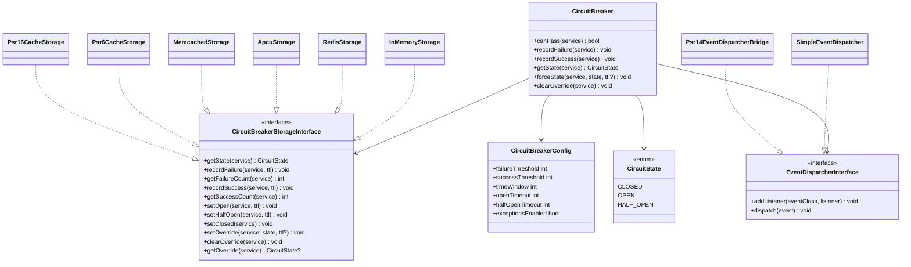
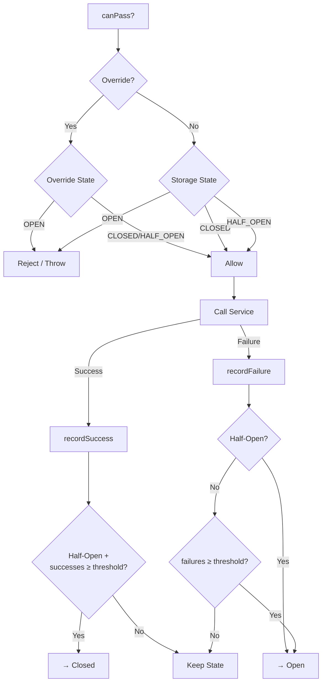

# Architecture

[< Back to README](../README.md)

## Class Diagram



## Directory Structure

```
src/
├── CircuitBreaker.php              # Main orchestrator
├── CircuitBreakerConfig.php        # Immutable config value object
├── CircuitState.php                # State enum (CLOSED, OPEN, HALF_OPEN)
├── Clock/
│   ├── Clock.php                   # Internal clock interface
│   ├── SystemClock.php             # Production clock
│   └── TestClock.php               # Manual time control for tests
├── Storage/
│   ├── CircuitBreakerStorageInterface.php
│   ├── InMemoryStorage.php
│   ├── RedisStorage.php
│   ├── ApcuStorage.php
│   ├── MemcachedStorage.php
│   ├── Psr6CacheStorage.php
│   └── Psr16CacheStorage.php
├── Event/
│   ├── CircuitBreakerEvent.php     # Abstract base event
│   ├── CircuitOpenedEvent.php
│   ├── CircuitClosedEvent.php
│   ├── CircuitHalfOpenEvent.php
│   ├── FailureRecordedEvent.php
│   ├── SuccessRecordedEvent.php
│   ├── EventDispatcherInterface.php
│   ├── SimpleEventDispatcher.php
│   └── Psr14EventDispatcherBridge.php
└── Exception/
    ├── CircuitBreakerException.php # Base exception
    ├── OpenCircuitException.php    # Thrown when circuit is open
    └── StorageException.php        # Storage backend errors
```

## Request Flow


