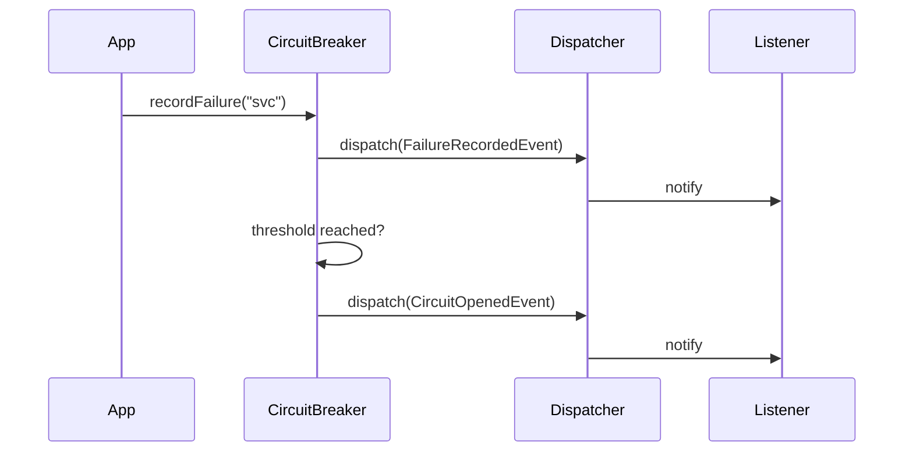

# Event System

[< Back to README](../README.md)

React to circuit breaker state changes with lightweight events.

## Available Events

All events extend `CircuitBreakerEvent` and carry `serviceName` and `occurredAt`:

| Event | Fired When |
|-------|------------|
| `CircuitOpenedEvent` | Circuit transitions to OPEN |
| `CircuitClosedEvent` | Circuit transitions to CLOSED |
| `CircuitHalfOpenEvent` | Circuit transitions to HALF_OPEN |
| `FailureRecordedEvent` | A failure is recorded |
| `SuccessRecordedEvent` | A success is recorded |

## Event Flow



## Using SimpleEventDispatcher

```php
use GabrielAnhaia\PhpCircuitBreaker\Event\SimpleEventDispatcher;
use GabrielAnhaia\PhpCircuitBreaker\Event\CircuitOpenedEvent;
use GabrielAnhaia\PhpCircuitBreaker\Event\CircuitBreakerEvent;

$dispatcher = new SimpleEventDispatcher();

// Listen for a specific event
$dispatcher->addListener(CircuitOpenedEvent::class, function (CircuitOpenedEvent $event): void {
    error_log("Circuit opened for {$event->getServiceName()} at {$event->getOccurredAt()->format('c')}");
});

// Listen for ALL circuit breaker events
$dispatcher->addListener(CircuitBreakerEvent::class, function (CircuitBreakerEvent $event): void {
    $metrics->record($event::class, $event->getServiceName());
});

$cb = new CircuitBreaker($storage, $config, $dispatcher);
```

## PSR-14 Bridge

If your application uses a PSR-14 event dispatcher, wrap it:

```php
use GabrielAnhaia\PhpCircuitBreaker\Event\Psr14EventDispatcherBridge;

$bridge = new Psr14EventDispatcherBridge($yourPsr14Dispatcher);
$cb = new CircuitBreaker($storage, $config, $bridge);
```

Register listeners with your PSR-14 implementation directly — the bridge only forwards `dispatch()` calls.
